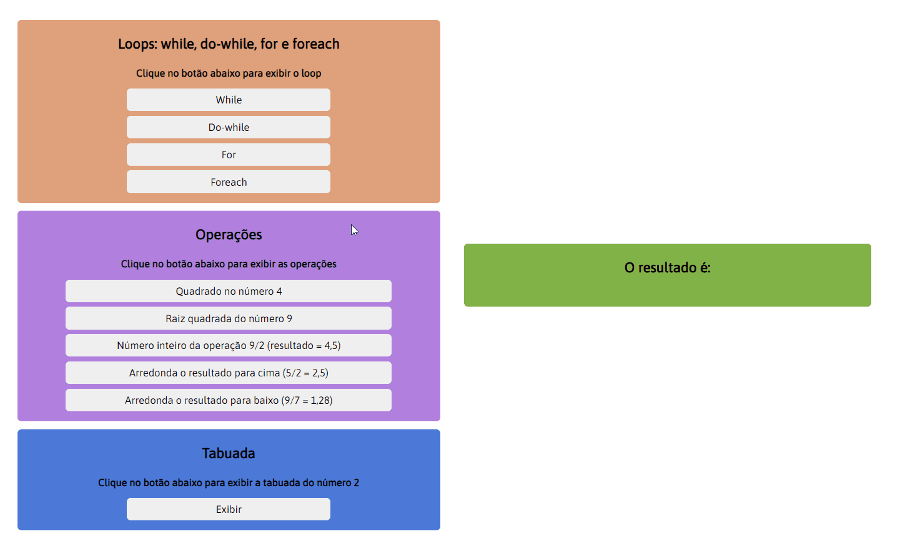

# O projeto

Este projeto foi criado para o curso QA Engineer - Analista de softwares da Ultima School. 
Nele foi utilizado as linguagens HTML5, CSS3 e JavaScript. 

O projeto me ajudou muito a entender a lógica dos loops (while, do-while, for e foreach), das operações matemáticas e a concatenar exibindo uma tabuada 🤩.

## Observações

- Ainda não foi implementado a responsividade neste projeto. 

- Link do projeto no gitpages: https://lephyns.github.io/projeto-javascript-ultima-school/

- Abaixo tela do projeto:

    